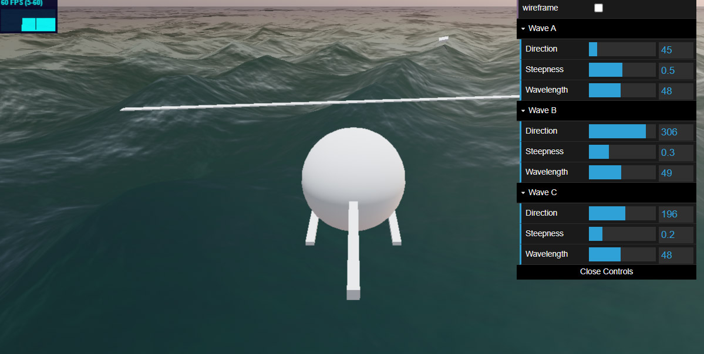
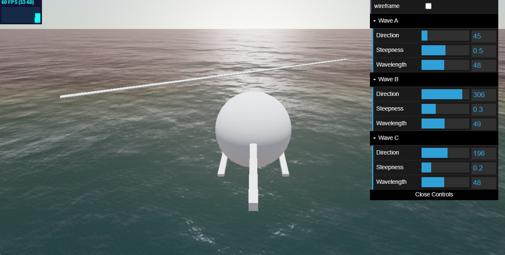

# Gerstner Water

```bash
git clone https://github.com/Sean-Bradley/GerstnerWater.git
cd GerstnerWater
npm install
npm run dev
```

Water viewed from 20m height.



Water viewed from 1000m height.




